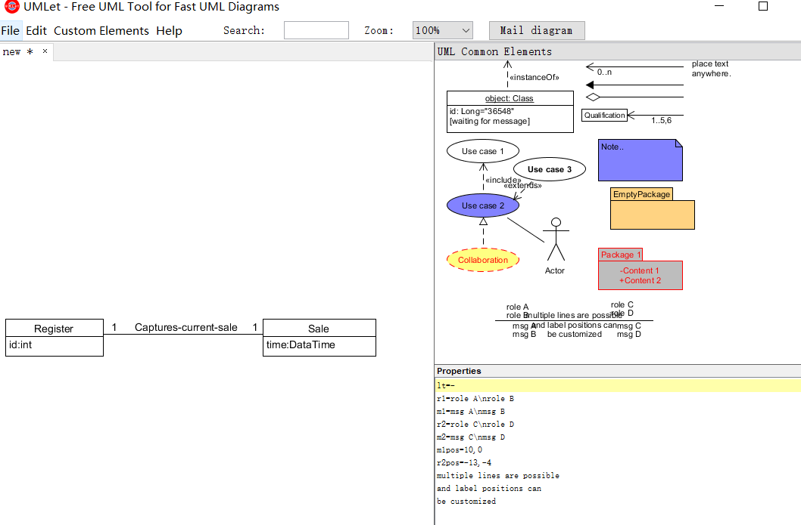

1、简答题
-----------------
* 用简短的语言给出对分析、设计的理解。

  答：分析是对问题和需要的调查研究，而不是解决方案；设计强调的是满足需求的概念上的解决方案，包括软件方面和硬件方面。

* 用一句话描述描述面向对象的分析与设计的优势。

  答：面向对象方法以客观世界中的对象为中心，其分析和设计思想符合人们的思维方式，能够构建与现实世界相对应的问题模型。

* 简述UML（统一建模语言）的作用。考试考哪些图？

  答：UML是一种开放的建模语言，用于说明、可视化、构建和编写一个正在开发的、面向对象的、软件密集系统的制品的开放方法。

 uml有一共14种图：

 * 结构性图形（Structure diagrams）强调的是系统式的建模：
   * 静态图（static diagram）
     * 类图
     * 对象图
     * 包图
   * 实现图（implementation diagram）
     * 组件图
     * 部署图
   * 剖面图
   * 复合结构图
 * 行为式图形（Behavior diagrams）强调系统模型中触发的事件：
   * 活动图
   * 状态图
   * 用例图
 * 交互性图形（Interaction diagrams），属于行为图形的子集合，强调系统模型中的资料流程：
   * 通信图
   * 交互概述图（UML 2.0）
   * 时序图（UML 2.0）
   * 时间图（UML 2.0）

* 从软件的角度，解释软件范围（需求）控制的可行性。

  答：软件范围控制的可行性指的是从获取的需求中选取最终的项目需求，然后制定除软件产品的详细描述。由于软件本身的复杂性、不可视性、可变性，软件范围多数情况下对于客户和开发者都是模糊的。我们只要在满足客户基本需求的前提下，不断砍去用户不明确的需求，完成基本功能，再通过多次迭代就能实现最终的软件设计。
 
2、项目管理实践
-----
* 看板使用练习（提交看板执行结果贴图，建议使用Git project)
 * 使用截图工具（png格式输出），展现你团队的任务Kanban。
 * 每个人的任务是明确的。必须一周后可以看到具体结果。
 * 每个人的任务是1-2项。
 * 至少包含一个团队活动任务。
 
* UML绘图工具练习（提交贴图，必须使用UMLet)
 * 至少包含一个团队活动任务。
 
